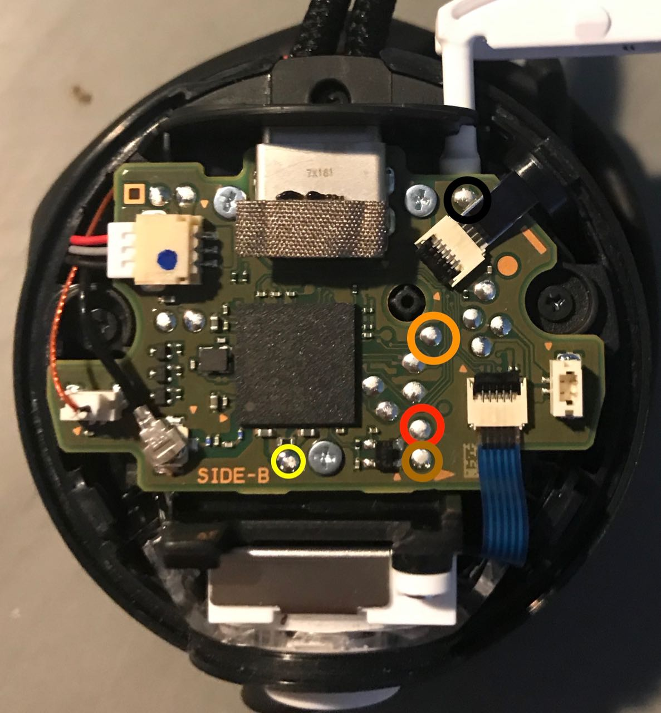
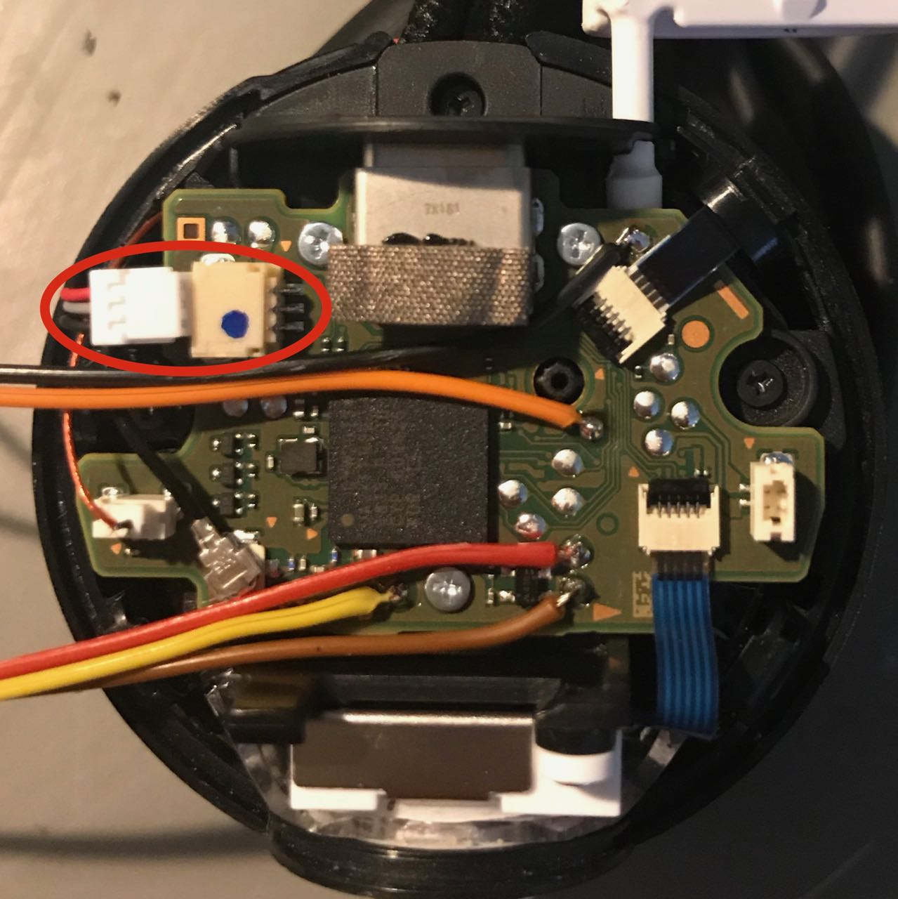
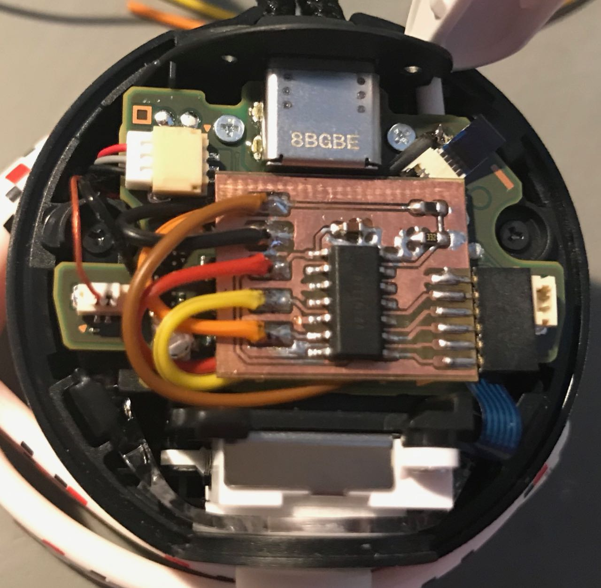

# Pokeball Auto Catcher

## Problem & goal

To perform a auto catch with a pokeball plus you have normally two options:

* Warp a rubber band and a coin or the safety band from the ball around the ball so the red button is permanently pressed.
	* pro: simple, reversible, cheap, Pokeball is still as controller useable
	* con: tricky to wrap, drains after a session (1h) the battery 
*  Wire the vibration to the button.
	* pro: simple, cheap (when you have a solder iron and a wire :)
	* con: The Vibration unit work at a voltage of 5V and the button input has only 1.8 V, to use the Pokeball as controller You must disable the vibration function before the mod.

We need a third option which fit the following requirements:

* usable as controller without restrictions
* less tricky
* more exensive as a rubber band or a wire
* hard to install 
* and more complex

## Solderpoints

Color | Signal
------|-------
black | Ground 
orange | Top button 
red | 1.8 V Vcc
yellow | 1.2 V (core voltage?)
brown | 5 V (LEDs & vibration unit)

## Wiring

Don't forget to unplug the battery, before You soldering!

## Finished mod

## How it works

The attiny measure with the analog comparator the core(?) voltage and the voltage for the LED and vibration unit. If the ball is turned on with the top button (press more as 120 ms), then the auto catch function is active. Every time when the voltage for the LED and vibration unit is turned on, the attiny "press" the button for 1 second. 

## Project status
Its work for me and my family -> Project closed for me.
Open points:
* clean up the pcb:
	* i think the ground plane and the 1V8 route in the near of the wiring is a bad idea
	*  sort the wire solder points in the order of wire from the ball-> less wire crossing 
	*  reorder the attiny pins, see point above
*  the attiny need 70 µs to turn on the bandgap reference which is realized with a delay function (actual 100 µs), a timer based solution could save more power?

## Bill of material
* 1x 6 pin female Connector pitch 1.27 mm (50 mil), I use Connfly Receptacles (standard) No. of rows: 1 Pins per row: 6 DS1065-01-1*6S8BV
* 1x 6 pin male connector pitch 1.27 mm (50 mil), BKL Electronic Pin strip (standard) No. of rows: 1 Pins per row: 6 10120623
* 2x3 pin male connector (AVR ISP standard), W & P Products 137-06-1-00-2 Tray Terminal Strip Number of pins: 2 x 3 mm
* PCB material Photo-coating Positive single sided 35 µm Material thickness **0.5 mm**, it's really narrow in the ball.
* Atmel ATTiny441-SSU (SOIC-14)
* Resistor 0805 10k
* Resistor 0805 3.3k
* Capacitor 0805 10k
